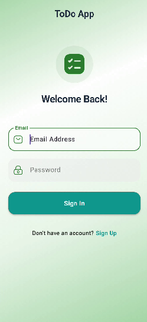
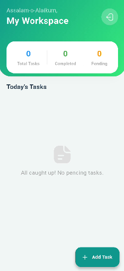
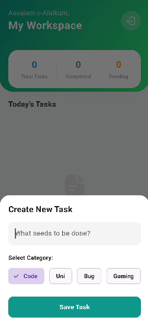
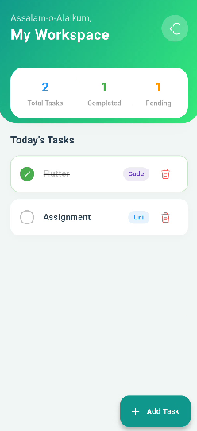

# todo_list_flutter

A new Flutter project.

## Getting Started

This project is a starting point for a Flutter application.

A few resources to get you started if this is your first Flutter project:

- [Learn Flutter](https://docs.flutter.dev/get-started/learn-flutter)
- [Write your first Flutter app](https://docs.flutter.dev/get-started/codelab)
- [Flutter learning resources](https://docs.flutter.dev/reference/learning-resources)

For help getting started with Flutter development, view the
[online documentation](https://docs.flutter.dev/), which offers tutorials,
samples, guidance on mobile development, and a full API reference.
# Todo App 🚀

A modern full-stack ToDo application built with Flutter, Provider, and Firebase Cloud Firestore.

## Screenshots

  
  
  
  

